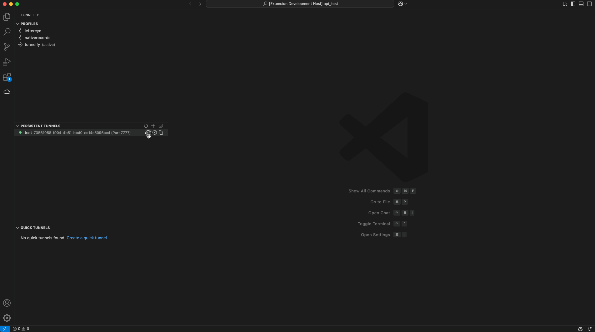

# Tunnelfy

<div align="center">
<br />
<a href="https://www.producthunt.com/posts/tunnelfy?embed=true&utm_source=badge-featured&utm_medium=badge&utm_souce=badge-tunnelfy" target="_blank"></a> &nbsp;&nbsp;
<a href="https://www.producthunt.com/posts/tunnelfy?embed=true&utm_source=badge-top-post-topic-badge&utm_medium=badge&utm_souce=badge-tunnelfy" target="_blank"></a>
</div>
<br />
Managing Cloudflare tunnels directly from a VS Code extension has never been easier. Streamline your development workflow by creating and managing permanent and quick tunnels without leaving your IDE.
<br />
<br />


## Table of Contents

- [Features](#features)
  - [Profile Management](#profile-management)
  - [Tunnel Monitoring and Control](#tunnel-monitoring-and-control)
  - [Docker Integration](#docker-integration)
  - [System Service Integration](#system-service-integration)
- [Prerequisites](#prerequisites)
- [Getting Started](#getting-started)
  - [1. Install the Extension](#1-install-the-extension)
  - [2. Install Cloudflare Tunnel CLI](#2-install-cloudflare-tunnel-cli-cloudflared)
  - [3. Create a Profile](#3-create-a-profile)
  - [4. Persistent Tunnels](#4-persistent-tunnels)
  - [5. Quick Tunnels](#5-quick-tunnels)
  - [6. Docker Support](#6-docker-support)
  - [7. System Service Support](#7-system-service-support)
- [Extension Commands](#extension-commands)
  - [Profile Management](#profile-management-1)
  - [Permanent Tunnel Management](#permanent-tunnel-management)
  - [Quick Tunnel Management](#quick-tunnel-management)
  - [Docker Support](#docker-support)
  - [System Service Support](#system-service-support)
- [Troubleshooting](#troubleshooting)
  - [Common Issues](#common-issues)
- [Security](#security)
- [Contributing](#contributing)
- [License](#license)
- [Support](#support)
- [Installing Cloudflare Tunnel CLI](#installing-cloudflare-tunnel-cli-cloudflared)
  - [Linux Installation](#linux-installation)
  - [Windows Installation](#windows-installation)
  - [macOS Installation](#macos-installation-homebrew)

## Features

### Profile Management

- Manage multiple Cloudflare profiles with API keys
- Securely store API keys using VS Code's built-in secret storage
- Switch between profiles easily
- Each profile maintains its own configuration and tunnels

### Tunnel Monitoring and Control

- View all your Cloudflare tunnels with status indicators
- Start and stop tunnels
- Manage permanent and quick tunnels
- Securely access tunnel tokens for configuration
- View detailed tunnel information
- Run tunnels with persistent background operation

### Docker Integration

- Generate Docker Compose files for any tunnel with one click
- Secure token management through environment files
- Support for both host and container-based services
- Easy network configuration for Docker environments
- Simple start/stop commands with docker compose

### System Service Integration

- Built-in system service support for running tunnels as system services

## Prerequisites

1. VS Code (v1.85.0 or higher)
2. A Cloudflare account with API key access
3. Cloudflare Tunnel CLI (`cloudflared`) installed
4. (Optional) Docker and Docker Compose for containerized tunnels

## Getting Started

### 1. Install the Extension

1. Open VS Code
2. Go to Extensions (Ctrl+Shift+X / Cmd+Shift+X)
3. Search for "Tunnelfy"
4. Click Install

### 2. Install Cloudflare Tunnel CLI (`cloudflared`)


1. Follow the instructions in the [Installing Cloudflare Tunnel CLI (`cloudflared`)](#installing-cloudflare-tunnel-cli-cloudflared) section

### 3. Create a Profile


1. Click the cloud icon in the activity bar
2. Click the + button in the Profiles section
3. Enter a name for your profile
4. Enter your Cloudflare API key. You can create one by:
   1. Navigating to the Cloudflare Dashboard
   2. Clicking on the "My Profile" icon
   3. Clicking on "API Tokens"
   4. Clicking on "Create Token"
   5. Selecting the following permissions:
   - Account: Account Settings: Read
   - Account: Cloudflare Tunnel: Edit
   - Zone: DNS: Edit
   6. Client IP Address Filtering (OPTIONAL but recommended):
   - Operator: Is in
   - Value: `Your IP Address` (Can be found with <https://nordvpn.com/what-is-my-ip>)
   - The API key will be stored securely and never displayed again

### 4. Persistent Tunnels


1. Click the + button in the Tunnels section
2. Enter a name for your tunnel
3. Once created, you can:
   - Start and stop the tunnel
   - View tunnel information and sample configuration setups
   - Copy the tunnel token
   - Delete the tunnel
   - Generate Docker Compose configuration

### 5. Quick Tunnels


1. Click the + button in the Quick Tunnels section
2. Configure your local service details:
   - Port number
3. Once running, you can:
   - Copy the Cloudflare-assigned hostname
   - Stop the tunnel

### 6. Docker Support



Built-in Docker support for running tunnels in containers:

1. Hover over any tunnel in the Persistent Tunnels view
2. Click the Docker icon (leftmost button)
3. Two files will be generated and opened in your editor:
   - `docker-compose.<tunnel-name>.yml` - The Docker Compose configuration
   - `cloudflare.<tunnel-name>.env` - Contains the secure tunnel token

### System Service Support

- Built-in system service support for running tunnels as system services

### Using the Generated Files

1. Rename the compose file:

   ```bash
   mv docker-compose.<tunnel-name>.yml docker-compose.yml
   ```

2. Start the tunnel:

   ```bash
   docker compose up -d
   ```

3. Stop the tunnel:

   ```bash
   docker compose down
   ```

### Docker Configuration Features

- **Secure Token Management**

  - Tunnel token stored in separate environment file
  - Environment file automatically loaded by Docker Compose
  - Easy to add to `.gitignore` for security

- **Service Connection Options**

  - Default: Connects to services on your host machine via `host.docker.internal`
  - Optional: Connect to other Docker services using Docker networks
  - Configurable URL and port settings

- **Container Management**
  - Automatic container restart on failure
  - Clean shutdown with compose down
  - Standard Docker Compose workflow

### Example Configuration

The generated Docker Compose file is simple and focused:

```yaml
services:
  your-tunnel:
    image: cloudflare/cloudflared:latest
    command: tunnel --no-autoupdate --url http://host.docker.internal:8080 run
    env_file:
      - cloudflare.your-tunnel.env
    restart: unless-stopped
```

To connect to other Docker services, you can add network configuration as documented in the generated file.

## System Service Integration

### System Service Generation

Built-in system service support for running tunnels as system services:

1. Hover over any tunnel in the Persistent Tunnels view
2. Click the gear icon (rightmost button)
3. Two files will be generated and opened in your editor:
   - `cloudflared-<tunnel-name>.service` - The systemd service configuration
   - `cloudflared-<tunnel-name>.env` - Contains the secure tunnel token

### Using the Generated Files

1. Copy the service file to the systemd directory:

   ```bash
   sudo cp cloudflared-<tunnel-name>.service /etc/systemd/system/
   ```

2. Create the environment file directory and copy the env file:

   ```bash
   sudo mkdir -p /etc/cloudflared
   sudo cp cloudflared-<tunnel-name>.env /etc/cloudflared/
   ```

3. Set proper permissions:

   ```bash
   sudo chown root:root /etc/systemd/system/cloudflared-<tunnel-name>.service
   sudo chmod 644 /etc/systemd/system/cloudflared-<tunnel-name>.service
   sudo chown cloudflared:cloudflared /etc/cloudflared/cloudflared-<tunnel-name>.env
   sudo chmod 600 /etc/cloudflared/cloudflared-<tunnel-name>.env
   ```

4. Start the service:

   ```bash
   sudo systemctl daemon-reload
   sudo systemctl enable cloudflared-<tunnel-name>
   sudo systemctl start cloudflared-<tunnel-name>
   ```

### System Service Features

- **Secure Configuration**

  - Service runs as dedicated cloudflared user
  - Environment file with restricted permissions
  - Systemd security hardening options enabled

- **Service Management**

  - Automatic service startup on boot
  - Automatic restart on failure
  - Standard systemd service controls
  - Proper logging to system journal

- **Security Hardening**
  - Protected system and home directories
  - Private /tmp directory
  - No new privileges escalation
  - Restricted service user permissions

### Example Configuration

The generated service file includes comprehensive security settings:

```ini
[Unit]
Description=Cloudflare Tunnel - <tunnel-name>
After=network.target
StartLimitIntervalSec=0

[Service]
Type=simple
User=cloudflared
Group=cloudflared
Restart=always
RestartSec=1
EnvironmentFile=/etc/cloudflared/cloudflared-<tunnel-name>.env
ExecStart=/usr/local/bin/cloudflared tunnel --no-autoupdate --url http://localhost:<port> run

# Hardening options
ProtectSystem=strict
ProtectHome=true
PrivateTmp=true
NoNewPrivileges=true

[Install]
WantedBy=multi-user.target
```

## Extension Commands

Several commands are accessible via the Command Palette (Ctrl+Shift+P / Cmd+Shift+P):

### Profile Management

- `Tunnelfy: Create Profile` - Create a new Cloudflare profile with an API key
- `Tunnelfy: Switch Profile` - Switch between Cloudflare profiles
- `Tunnelfy: Delete Profile` - Delete a Cloudflare profile

### Permanent Tunnel Management

- `Tunnelfy: Create Tunnel` - Create a new permanent tunnel
- `Tunnelfy: Refresh Tunnels` - Refresh the list of tunnels
- `Tunnelfy: Start Tunnel` - Start a tunnel
- `Tunnelfy: Stop Tunnel` - Stop a tunnel
- `Tunnelfy: View Tunnel Info` - View detailed information about a tunnel
- `Tunnelfy: Copy Tunnel Token` - Copy the token of a tunnel
- `Tunnelfy: Delete Tunnel` - Delete a tunnel
- `Tunnelfy: Generate Docker Compose` - Generate Docker Compose files for running the tunnel in Docker

### Quick Tunnel Management

- `Tunnelfy: Create Quick Tunnel` - Create a new quick tunnel
- `Tunnelfy: Copy Quick Tunnel URL` - Copy the URL of a quick tunnel
- `Tunnelfy: Stop Quick Tunnel` - Stop a quick tunnel

## Docker Support

- `Tunnelfy: Generate Docker Compose` - Generate Docker Compose files for running the tunnel as a Docker service

### Generating Docker Compose Files

1. Hover over a tunnel in the Persistent Tunnels view
2. Click the Docker icon (leftmost button)
3. A `docker-compose.{tunnel-name}.yml` file will be generated in your workspace

The generated Docker Compose file includes:

- A service running the Cloudflare tunnel with your tunnel token
- A placeholder service for your application
- A shared network for communication between services

Example Docker Compose file:

```yaml
version: "3"

services:
  my-tunnel:
    image: cloudflare/cloudflared:latest
    command: tunnel --no-autoupdate run
    environment:
      - TUNNEL_TOKEN=your-tunnel-token
    restart: unless-stopped
    networks:
      - tunnel-net

  app:
    # Replace this with your application's image and configuration
    image: your-app-image:latest
    ports:
      - "8080:8080"
    networks:
      - tunnel-net

networks:
  tunnel-net:
    driver: bridge
```

To use the generated file:

1. Replace `your-app-image:latest` with your actual application image
2. Add any necessary environment variables or volumes for your app
3. Run `docker-compose -f docker-compose.{tunnel-name}.yml up -d`

## Troubleshooting

### Common Issues

1. **Invalid API Key**

   - Make sure your API key has the correct permissions (Cloudflare Tunnel:Edit)
   - Verify the API key is still active in your Cloudflare dashboard
   - Try creating a new API key if issues persist

2. **Profile Switching Issues**

   - Ensure the API key for the profile is still valid
   - Check your internet connection
   - Try deleting and recreating the profile if issues persist

3. **Tunnel Creation Fails**

   - Verify your API key has sufficient permissions
   - Check if you've reached your account's tunnel limit
   - Ensure you have a stable internet connection

4. **Connecting Tunnels to Domains/Subdomains**

   - Ensure you have a persistent tunnel created with any display name you choose.
   - Your list of domains/subdomains will not be presented until you run a tunnel.

5. **Quick Tunnel Issues**

   - Verify cloudflared is installed and accessible
   - Check if the port is already in use
   - Look for rate limiting messages in the output
   - Ensure you have a stable internet connection

6. **Development Environment Issues**

   - Run `npm install` to ensure all dependencies are installed
   - Clear the VS Code extension development host: `rm -rf .vscode-test`
   - Check the extension logs in the Output panel
   - Verify cloudflared installation and permissions

7. **Persistent Tunnel Disappears When Extension is Closed**
   - This is expected behavior. The tunnel will remain running in the background.
   - For persistent tunnel setups:
     1. use the `Tunnelfy: Generate Docker Compose` command to create a Docker Compose file for your tunnel.
     2. use a system service (systemd, etc) to start the tunnel on boot (File generation in future updates).

## Security

- API keys are stored securely using VS Code's built-in secret storage
- Keys are never displayed after initial entry
- Each profile maintains its own isolated API key
- No sensitive data is stored in plain text

## Contributing

We welcome contributions! Here's how you can help:

1. **Fork the Repository**

   - Create a fork of the repository
   - Clone your fork locally

2. **Set Up Development Environment**

   ```bash
   # Install dependencies
   npm install
   npm install -g yo generator-code

   # Install recommended VS Code extensions
   code --install-extension dbaeumer.vscode-eslint
   code --install-extension esbenp.prettier-vscode
   ```

3. **Create a Feature Branch**

   ```bash
   git checkout -b feature/your-feature
   ```

4. **Make Your Changes**

   - Write code following our style guidelines
   - Add tests for new functionality
   - Update documentation as needed

5. **Test Your Changes**

   ```bash
   # Run the test suite
   npm test

   # Run ESLint
   npm run lint
   ```

6. **Create a Pull Request**
   - Push your changes to your fork
   - Create a pull request to our development branch
   - Follow the pull request template
   - Wait for review and address any feedback

For more detailed information about development, please see our [Development Guide](_DEV/DEVELOPMENT_README.md).

## License

This project is licensed under the MIT License - see the [LICENSE](LICENSE) file for details.

## Support

If you encounter any issues or have suggestions, please:

1. Check the [Troubleshooting](#troubleshooting) section
2. View the extension logs
3. Open an issue on GitHub
4. Email <info@tunnelfy.com> if all else fails (response time will be slow)

---

## Installing Cloudflare Tunnel CLI (`cloudflared`)

Cloudflare Tunnel CLI (`cloudflared`) allows you to securely control exposing local applications to the internet without opening firewall ports. It is an essential part of Tunnelfy functionality.

### Linux Installation

#### Debian/Ubuntu-based distributions

```bash
sudo apt update && sudo apt install -y curl
curl -fsSL https://github.com/cloudflare/cloudflared/releases/latest/download/cloudflared-linux-amd64 -o cloudflared
sudo chmod +x cloudflared
sudo mv cloudflared /usr/local/bin/
cloudflared --version
```

#### RHEL/Fedora-based distributions

```bash
sudo dnf install -y curl
curl -fsSL https://github.com/cloudflare/cloudflared/releases/latest/download/cloudflared-linux-amd64 -o cloudflared
sudo chmod +x cloudflared
sudo mv cloudflared /usr/local/bin/
cloudflared --version
```

#### Arch Linux-based distributions

```bash
yay -S cloudflared-bin
cloudflared --version
```

### Windows Installation

#### Using the MSI Installer

1. Download the latest **Cloudflare Tunnel client** from:
   - [Cloudflare Tunnel Download](https://developers.cloudflare.com/cloudflare-one/connections/connect-apps/install-and-setup/)
2. Run the installer and follow the prompts.
3. Verify installation in **Command Prompt** or **PowerShell**:

```powershell
cloudflared --version
```

#### Using Chocolatey

```powershell
choco install cloudflared
cloudflared --version
```

#### Using Winget

```powershell
winget install Cloudflare.cloudflared
cloudflared --version
```

### macOS Installation (Homebrew)

```bash
brew install cloudflare/cloudflare/cloudflared
brew services start cloudflared
cloudflared --version
```
