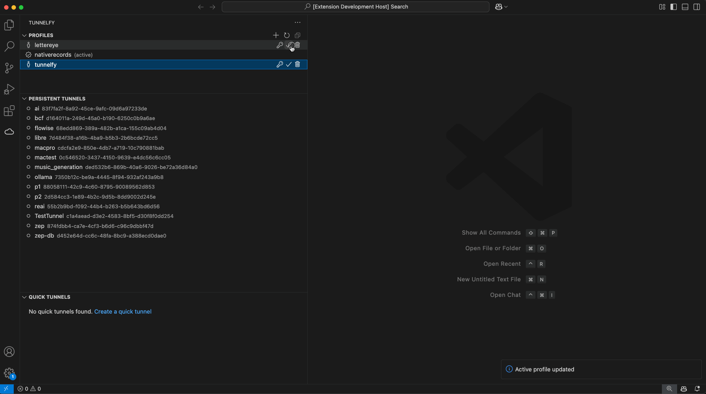
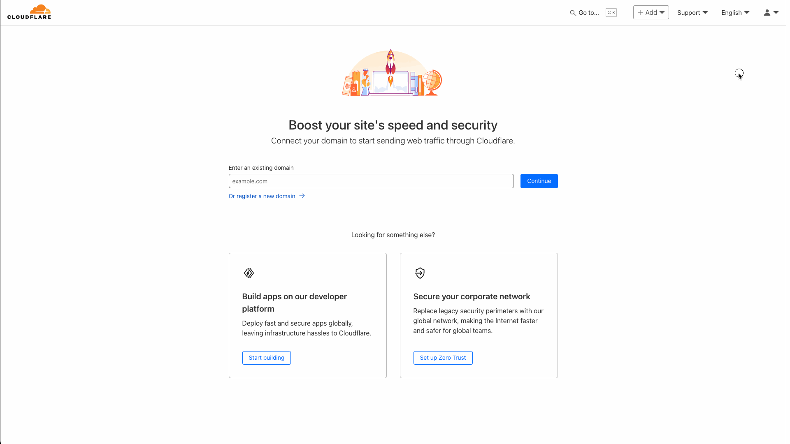
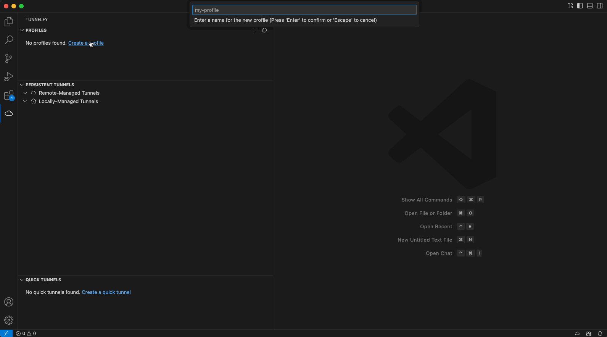
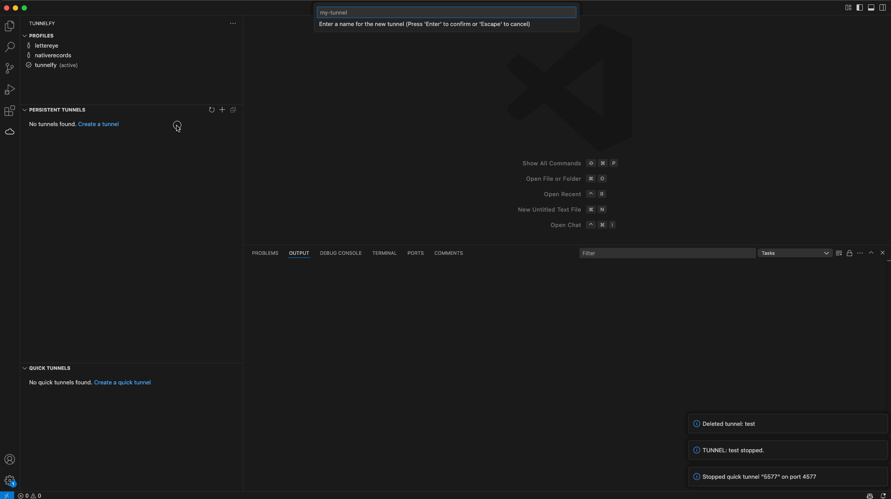
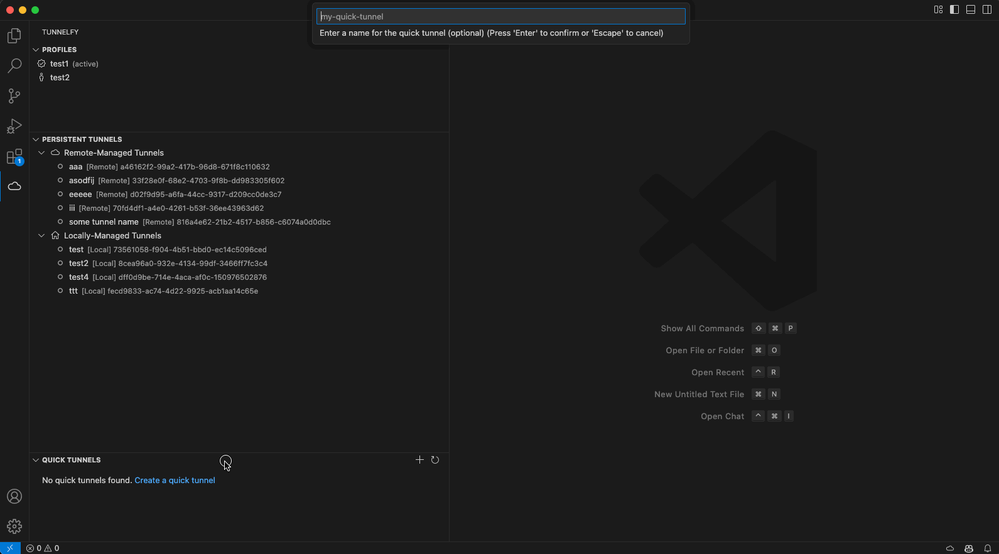

# Tunnelfy

Managing Cloudflare tunnels directly from a VS Code extension has never been easier. Streamline your development workflow by creating and managing permanent and quick tunnels without leaving your IDE.



## Features

### Profile Management

- Manage multiple Cloudflare profiles with API keys
- Securely store API keys using VS Code's built-in secret storage
- Switch between profiles easily
- Each profile maintains its own configuration and tunnels

### Tunnel Monitoring and Control

- View all your Cloudflare tunnels with status indicators
- Start and stop tunnels
- Manage permanent and quick tunnels
- Securely access tunnel tokens for configuration
- View detailed tunnel information
- Run tunnels with persistent background operation

## Prerequisites

1. VS Code (v1.85.0 or higher)
2. A Cloudflare account with API key access 
3. Cloudflare Tunnel CLI (`cloudflared`) installed

## Getting Started

### 1. Install the Extension

1. Open VS Code
2. Go to Extensions (Ctrl+Shift+X / Cmd+Shift+X)
3. Search for "Tunnelfy"
4. Click Install

### 2. Install Cloudflare Tunnel CLI (`cloudflared`)



1. Follow the instructions in the [Installing Cloudflare Tunnel CLI (`cloudflared`)](#installing-cloudflare-tunnel-cli-cloudflared) section

### 3. Create a Profile



1. Click the cloud icon in the activity bar
2. Click the + button in the Profiles section
3. Enter a name for your profile
4. Enter your Cloudflare API key. You can create one by:
   1. Navigating to the Cloudflare Dashboard
   2. Clicking on the "My Profile" icon
   3. Clicking on "API Tokens"
   4. Clicking on "Create Token"
   5. Selecting the following permissions:
     - Account: Account Settings: Read 
     - Account: Cloudflare Tunnel: Edit
     - Zone: DNS: Edit
   6. Client IP Address Filtering (OPTIONAL but recommended):
     - Operator: Is in 
     - Value: `Your IP Address` (Can be found with https://nordvpn.com/what-is-my-ip)
   - The API key will be stored securely and never displayed again

### 4. Persistent Tunnels



1. Click the + button in the Tunnels section
2. Enter a name for your tunnel
3. Once created, you can:
   - Start and stop the tunnel
   - View tunnel information and sample configuration setups
   - Copy the tunnel token
   - Delete the tunnel

### 5. Quick Tunnels



1. Click the + button in the Quick Tunnels section
2. Configure your local service details:
   - Port number
3. Once running, you can:
   - Copy the Cloudflare-assigned hostname
   - Stop the tunnel

## Extension Commands

Several commands are accessible via the Command Palette (Ctrl+Shift+P / Cmd+Shift+P):

### Profile Management
- `Tunnelfy: Create Profile` - Create a new Cloudflare profile with an API key
- `Tunnelfy: Switch Profile` - Switch between Cloudflare profiles
- `Tunnelfy: Delete Profile` - Delete a Cloudflare profile

### Permanent Tunnel Management
- `Tunnelfy: Create Tunnel` - Create a new permanent tunnel
- `Tunnelfy: Refresh Tunnels` - Refresh the list of tunnels
- `Tunnelfy: Start Tunnel` - Start a tunnel
- `Tunnelfy: Stop Tunnel` - Stop a tunnel
- `Tunnelfy: View Tunnel Info` - View detailed information about a tunnel
- `Tunnelfy: Copy Tunnel Token` - Copy the token of a tunnel
- `Tunnelfy: Delete Tunnel` - Delete a tunnel

### Quick Tunnel Management
- `Tunnelfy: Create Quick Tunnel` - Create a new quick tunnel
- `Tunnelfy: Copy Quick Tunnel URL` - Copy the URL of a quick tunnel
- `Tunnelfy: Stop Quick Tunnel` - Stop a quick tunnel

## Troubleshooting

### Common Issues

1. **Invalid API Key**
   - Make sure your API key has the correct permissions (Cloudflare Tunnel:Edit)
   - Verify the API key is still active in your Cloudflare dashboard
   - Try creating a new API key if issues persist

2. **Profile Switching Issues**
   - Ensure the API key for the profile is still valid
   - Check your internet connection
   - Try deleting and recreating the profile if issues persist

3. **Tunnel Creation Fails**
   - Verify your API key has sufficient permissions
   - Check if you've reached your account's tunnel limit
   - Ensure you have a stable internet connection

4. **Quick Tunnel Issues**
   - Verify cloudflared is installed and accessible
   - Check if the port is already in use
   - Look for rate limiting messages in the output
   - Ensure you have a stable internet connection

5. **Development Environment Issues**
   - Run `npm install` to ensure all dependencies are installed
   - Clear the VS Code extension development host: `rm -rf .vscode-test`
   - Check the extension logs in the Output panel
   - Verify cloudflared installation and permissions

## Security

- API keys are stored securely using VS Code's built-in secret storage
- Keys are never displayed after initial entry
- Each profile maintains its own isolated API key
- No sensitive data is stored in plain text

## Contributing

We welcome contributions! Here's how you can help:

1. **Fork the Repository**
   - Create a fork of the repository
   - Clone your fork locally

2. **Set Up Development Environment**
   ```bash
   # Install dependencies
   npm install
   npm install -g yo generator-code

   # Install recommended VS Code extensions
   code --install-extension dbaeumer.vscode-eslint
   code --install-extension esbenp.prettier-vscode
   ```

3. **Create a Feature Branch**
   ```bash
   git checkout -b feature/your-feature
   ```

4. **Make Your Changes**
   - Write code following our style guidelines
   - Add tests for new functionality
   - Update documentation as needed

5. **Test Your Changes**
   ```bash
   # Run the test suite
   npm test

   # Run ESLint
   npm run lint
   ```

6. **Create a Pull Request**
   - Push your changes to your fork
   - Create a pull request to our development branch
   - Follow the pull request template
   - Wait for review and address any feedback

For more detailed information about development, please see our [Development Guide](_DEV/DEVELOPMENT_README.md).

## License

This project is licensed under the MIT License - see the [LICENSE](LICENSE) file for details.

## Support

If you encounter any issues or have suggestions, please:
1. Check the [Troubleshooting](#troubleshooting) section
2. View the extension logs
3. Open an issue on GitHub
4. Email info@tunnelfy.com if all else fails (response time will be slow)


---

## Installing Cloudflare Tunnel CLI (`cloudflared`)

Cloudflare Tunnel CLI (`cloudflared`) allows you to securely control exposing local applications to the internet without opening firewall ports. It is an essential part of Tunnelfy functionality.

### Linux Installation
#### Debian/Ubuntu-based distributions
```bash
sudo apt update && sudo apt install -y curl
curl -fsSL https://github.com/cloudflare/cloudflared/releases/latest/download/cloudflared-linux-amd64 -o cloudflared
sudo chmod +x cloudflared
sudo mv cloudflared /usr/local/bin/
cloudflared --version
```

#### RHEL/Fedora-based distributions
```bash
sudo dnf install -y curl
curl -fsSL https://github.com/cloudflare/cloudflared/releases/latest/download/cloudflared-linux-amd64 -o cloudflared
sudo chmod +x cloudflared
sudo mv cloudflared /usr/local/bin/
cloudflared --version
```

#### Arch Linux-based distributions
```bash
yay -S cloudflared-bin
cloudflared --version
```

### Windows Installation
#### Using the MSI Installer
1. Download the latest **Cloudflare Tunnel client** from:
   - [Cloudflare Tunnel Download](https://developers.cloudflare.com/cloudflare-one/connections/connect-apps/install-and-setup/)
2. Run the installer and follow the prompts.
3. Verify installation in **Command Prompt** or **PowerShell**:
```powershell
cloudflared --version
```

#### Using Chocolatey
```powershell
choco install cloudflared
cloudflared --version
```

#### Using Winget
```powershell
winget install Cloudflare.cloudflared
cloudflared --version
```

### macOS Installation (Homebrew)
```bash
brew install cloudflare/cloudflare/cloudflared
brew services start cloudflared
cloudflared --version
```
